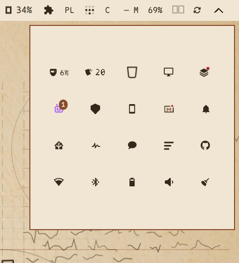

# Bar dock

**Your Omarchy bar is full. Put the icons you do not need every day behind one
chevron in the corner, and keep them one drag away.**



Every bar runs out of room eventually. Installing plugins is cheap, so the right
side grows until the widgets you actually look at are squeezed into a few pixels
next to the ones you installed once and forgot about. Bar dock gives you a single
square drawer in the corner for exactly those icons: drag one onto the chevron to
put it away, drag it back out when you want it again.

- **Nothing is disabled.** A docked plugin keeps running - its service stays up,
  its panel still opens, its notifications still arrive. The icon is just not on
  the bar any more.
- **The drawer is a square, and it grows with its contents.** One icon per cell in
  a square grid: 4 icons is 120 px, 16 is 212 px, 64 is 396 px, 225 is 718 px. The
  only ceiling is your screen, and past that the cells shrink instead of the icons
  spilling out of the square.
- **Real widgets, not snapshots.** A docked tile is the plugin's own bar widget
  instance, so clicking one opens its panel exactly like it does on the bar.
- **Drag both ways.** Drop an icon on the chevron (or anywhere in the last stretch
  of the bar) to dock it; drag it out of the drawer onto the bar to put it back -
  and it returns to the slot it came from, not to the end of the bar.
- **Reorder inside the drawer.** Drag a tile onto another cell and it takes that
  cell.

| Docked icons | Drawer | Grid | Cell |
| --- | --- | --- | --- |
| 4 | 120 x 120 | 2 x 2 | 46 px |
| 16 | 212 x 212 | 4 x 4 | 46 px |
| 36 | 304 x 304 | 6 x 6 | 46 px |
| 64 | 396 x 396 | 8 x 8 | 46 px |
| 100 | 488 x 488 | 10 x 10 | 46 px |
| 225 | 718 x 718 | 15 x 15 | 46 px |

## Install

```sh
omarchy plugin add https://github.com/ozz1ee-dev/omarchy-bardock.git --enable
omarchy bar move ozz1ee.bardock --section right --index 99
```

The first command installs and enables it; the second parks the chevron at the
right end of the bar, where it belongs. If the chevron does not appear within a
second, run `omarchy restart shell`.

Requirements: Omarchy Quattro (4.0.x) with its `bar-widget` plugin API. Nothing
else - no daemon, no separate process of its own, no network access, no extra
packages, and no patching of the shell.

## Which Omarchy releases it runs on

| Release | Where the config comes from | Docking an icon |
| --- | --- | --- |
| 4.0.0 - 4.0.2 | the bar hands the widget the whole `shell.json` | drag the icon onto the chevron, as always |
| 4.0.3 and later | the plugin reads and writes `~/.config/omarchy/shell.json` itself (the bar no longer publishes the document to a widget) | right-click the chevron, or use the small plus in the drawer, then click the widget in the list |

Everything else is identical on both: one chevron, a square drawer, real widget
instances inside it, and the same `shell.json` parking rule. Which generation the
plugin is talking to is decided from the objects the bar injects, so there is
nothing to configure and no version to remember.

## Use

- **Click the chevron** to open and close the drawer. Escape also closes it.
- **Dock an icon**: drag it along the bar towards the corner. The drawer opens as the
  icon arrives on the chevron - that is your cue that releasing now will dock it - and
  a release anywhere near the chevron (`dockZoneSlack`, 32 px by default) docks it.
  Everywhere else on the bar behaves exactly as it always did, so reordering is never
  disturbed, and the slot keeps a fixed width so nothing shifts while you drag.
- **Undock an icon**: open the drawer and drag a tile out onto the bar. The bar's
  own insertion marker shows the slot it will take.
- **Dock by picking instead of dragging** (Omarchy 4.0.3 and later): right-click
  the chevron, or click the small plus in the drawer's corner, for a list of the
  widgets that are on the bar, then click the one to keep off it.

On 4.0.3 and later the bar publishes no drag state and no slot list to a
third-party widget, so an icon cannot be dragged onto the chevron. Docking is the
pick above; dragging a tile out of the drawer and releasing it over the bar still
puts that icon back, at the end of the right section (the bar's insertion marker
is not available, so that slot is not previewed).
- **Reorder**: drag a tile onto another cell inside the drawer. The dragged tile
  dims and the target cell is outlined.
- **Hide something while keeping it alive**: that is all docking does. Use it for
  widgets you want loaded but do not want to look at.

## Where the icons go

Docking disables nothing and deletes nothing. It moves the widget's entry from the
bar layout (`bar.layout.right`) into the shell's own parking list (`plugins[]`) in
`~/.config/omarchy/shell.json`, which is what keeps the plugin loaded while
drawing no icon. Undocking moves it back, and Bar dock remembers which slot it
came from so it lands next to its old neighbours.

To put everything back on the bar at once:

```sh
omarchy-shell ozz1ee.bardock undockAll
```

The dock picker, and the verbs behind it, without a pointer:

```sh
omarchy-shell ozz1ee.bardock dockable          # what the picker would offer
omarchy-shell ozz1ee.bardock pick <id>         # dock it, as clicking it there does
omarchy-shell ozz1ee.bardock picker            # open the drawer showing that list
```

Do that before removing the plugin, otherwise the icons stay parked in
`plugins[]`. `omarchy-shell ozz1ee.bardock state` prints the drawer's current
state (docked list, size, grid) if you want to see what is where.

## Settings

```sh
omarchy bar set ozz1ee.bardock <key> <value>
```

| Key | Default | Meaning |
| --- | --- | --- |
| `cell` | `46` | Cell size in px. Bigger cells, bigger drawer. |
| `minSide` | `168` | Smallest drawer side. |
| `maxSide` | `0` | Optional cap on the drawer. `0` = no cap, the screen decides. |
| `minCell` | `20` | How small the cells may get when a lot of icons must fit the screen. |
| `dockOnNeighbourDrop` | `true` | Allow docking by dragging an icon onto the chevron. `false` leaves docking to the drag out of the drawer and the terminal. |
| `dockZoneSlack` | `32` | How far around the chevron a release still docks. The drawer itself opens only on the chevron, so a generous margin here never disturbs reordering. `0` = the chevron's own slot only. |
| `armMs` | `2500` | How long after a drag last hovered the chevron a drop beside it still counts. |
| `dragStallMs` | `10000` | Last-resort guard: a drag that has not moved for this long is treated as lost. Lost drags are cleared immediately, as soon as no live pointer is behind them. |

## How it works

The chevron is an ordinary `bar-widget`, so the bar's own drag machinery can
target it. A drop moves the widget's layout entry into the parked list; dragging
an icon out writes the entry back into the layout. Docked tiles are the plugins'
own widget components, taken from the bar's registry with the same `bar`,
`moduleName` and `settings` the bar injects. The drawer is a layer surface the
size of the square - not a full-screen overlay - and it is limited only by the
screen.

The two generations of the plugin API differ in what a widget can see. On
4.0.0-4.0.2 the bar injects its own object: the widget reads `shell.json` through
it, docks by mutating it, and hit-tests the bar's slots for drag and drop. On
4.0.3+ a third-party widget gets capability-scoped facades instead - no document,
no widget catalogue, no slot geometry - so the plugin keeps one code path over
two surfaces: the document comes from the file where the host does not hand it
over, the widget catalogue from this plugin's own service instance, and the
drag-to-dock gesture is absent where the geometry is.

The full engineering view, including the drop-zone rule, the
surface-versus-screen coordinates and the seams used to drive it from a terminal,
is in [docs/how-it-works.md](docs/how-it-works.md).

## Troubleshooting

| Symptom | Fix |
| --- | --- |
| No chevron on the bar | `omarchy bar move ozz1ee.bardock --section right --index 99`, then `omarchy restart shell`. |
| A drop beside the chevron docks nothing | That is the default on purpose: only the chevron itself docks, so bar reordering stays untouched. Want a wider pocket? `omarchy bar set ozz1ee.bardock dockZoneSlack 32`. |
| A docked icon shows its name as text instead of an icon | That widget reports no face of its own (a custom `qml`/`command` entry). It still works; the plate keeps the cell from being blank. If every tile does this, the widget catalogue is unavailable on this release - `omarchy-shell ozz1ee.bardock registry` will say `available: false`, and `omarchy restart shell` reloads the plugin's service instance that carries it. |
| The desktop looks frozen with a ghost icon on screen | A pointer release got lost mid-drag. Clear it from a terminal: `omarchy-shell ozz1ee.bardock reset`. It also heals itself as soon as no live pointer is behind the drag. |
| A docked icon looks off-centre | Widgets wider than their cell are centred in it. Raise `cell` to give the grid more room. |
| Icons missing from the bar after removing the plugin | They are parked in `plugins[]`. Re-add the plugin and run `undockAll`, or `omarchy bar put <id> --section right`. |

## Uninstall

```sh
omarchy-shell ozz1ee.bardock undockAll     # first: put every icon back
omarchy plugin remove ozz1ee.bardock --yes
```

## Development

Tests run on plain Node, no dependencies:

```sh
node --test test/*.test.js   # 52 tests over the pure geometry and layout logic
omarchy plugin validate .   # the manifest contract
```

The geometry, the layout mutations and the drop-zone maths live in `Model.js` as
pure functions with no Qt in them, which is why they can be tested from a
terminal. The QML side is `BarDock.qml` (widget, drawer, drags), `DockTile.qml`
(one docked icon), `DockGhost.qml` (the drag ghost) and `Chevron.qml` (the mark).

To develop against a checkout instead of an installed copy, link the repository
into the shell's plugin directory and put it on the bar:

```sh
ln -sfn "$PWD" ~/.config/omarchy/plugins/ozz1ee.bardock
omarchy plugin validate ~/.config/omarchy/plugins/ozz1ee.bardock
omarchy bar move ozz1ee.bardock --section right --index 99
omarchy restart shell
```

## What this is not

- Not a plugin disabler: nothing is unloaded, and no plugin is treated specially.
- Not a tray or a notification centre; it only moves icons around.
- Not a shell patch: it uses the public plugin API, so `omarchy update` does not
  overwrite it.
- No telemetry, no network access, no background process of its own.

## License

MIT, see [LICENSE](LICENSE).

The drawer writes your bar layout, and only when you dock, undock or reorder
something - it never touches the rest of `shell.json`.
